# E-Commerce User Behavior Analysis

**[中文版 →](README_CN.md)**

**Data-Driven Customer Segmentation & Growth Strategy Using RFM + K-Means Clustering**

> Analyzed ~1M real transaction records from the UCI Online Retail II dataset, delivering a complete pipeline from data cleaning to actionable product strategy recommendations.

---

## 📌 Background

In e-commerce, customer value varies dramatically — a small number of high-value customers often account for the majority of revenue. This project validates that hypothesis through data and produces differentiated operational strategies based on customer segmentation.

**Key Finding: 22% of customers contribute 68% of total revenue.**

---

## 🔬 Analysis Pipeline

```mermaid
graph LR
    A[📥 Raw Data<br/>1.07M transactions] --> B[🧹 Data Cleaning<br/>Missing values · Returns · Outliers]
    B --> C[📊 EDA<br/>Time · Geography · Products · Users]
    C --> D[🏷️ RFM Segmentation<br/>Recency · Frequency · Monetary]
    D --> E[🤖 K-Means Validation<br/>Cross-verify segments]
    E --> F[💡 Strategy<br/>Differentiated action plans]
    F --> G[📊 Dashboard<br/>Interactive visualization]

    style A fill:#1e1b4b,stroke:#818cf8,color:#e2e8f0
    style B fill:#1e1b4b,stroke:#818cf8,color:#e2e8f0
    style C fill:#1e1b4b,stroke:#34d399,color:#e2e8f0
    style D fill:#1e1b4b,stroke:#34d399,color:#e2e8f0
    style E fill:#1e1b4b,stroke:#fbbf24,color:#e2e8f0
    style F fill:#1e1b4b,stroke:#f87171,color:#e2e8f0
    style G fill:#1e1b4b,stroke:#c084fc,color:#e2e8f0
```



---

## 📈 Key Findings

| Dimension | Finding | Product Implication |
|-----------|---------|-------------------|
| ⏰ Time | Sales surge 40%+ during Sep–Nov (Christmas season), peaking in Nov | Begin holiday marketing prep in Q3 |
| 🌍 Geography | UK accounts for 83% of revenue | Overseas expansion requires retail vs. wholesale segmentation |
| 📦 Products | Top 20% of products drive 78% of revenue | Recommendation engine should focus on top SKUs |
| 👥 Users | Power-law distribution; median spend only £899 | Cannot design strategy around the "average user" |

---

## 🏷️ Customer Segments

RFM analysis segmented 5,878 customers into 8 groups:

| Segment | Count | Revenue Share | Strategy |
|---------|-------|--------------|----------|
| 💎 Loyal High-Value | 1,300 | 68.4% | VIP perks · Personalized recs · Loyalty program |
| 🌱 High Potential | 975 | 13.8% | Milestone rewards · Category expansion · Flash sales |
| 🚨 At-Risk High-Value | 227 | 5.7% | Urgent win-back · Exclusive coupons · Churn interviews |
| 👤 Regular | 1,102 | 4.6% | Standard maintenance |
| 💤 Dormant | 1,523 | 3.8% | Low-cost outreach · Batch testing |
| 👋 New | 443 | 2.2% | Onboarding emails · Second-order incentives |
| 🔄 Frequent Low-Spend | 182 | 0.9% | Cross-sell · AOV uplift |
| ⚠️ At-Risk Regular | 126 | 0.6% | Monitor · Low priority |

---

## 🤖 K-Means Clustering Validation

Applied K-Means (K=5) on standardized RFM features to cross-validate the rule-based segmentation:

- ✅ **Consistent**: 87% of dormant customers were identified by both methods
- 🔍 **New discovery**: K-Means detected 4 "extreme VIPs" (avg. spend £430K, likely wholesale) and 24 "super customers" (avg. £100K) that RFM failed to distinguish
- 💡 **Conclusion**: RFM excels in interpretability for daily operations; K-Means uncovers hidden patterns and extreme outliers. Best used in combination.

---

## 💡 Strategy Prioritization

```
P0 🚨 At-Risk High-Value    →  Win-back this week  (227 · proven high-LTV users)
P1 💎 Loyal High-Value      →  Launch VIP program   (1,300 · revenue lifeline)
P2 🌱 High Potential        →  Milestone incentives (975 · largest growth pool)
P3 👋 New Customers         →  Second-order nudge   (443 · long-term cultivation)
P4 💤 Dormant               →  Low-cost batch test  (1,523 · don't over-invest)

Core principle: Allocate 80% of resources to P0–P2, covering 87.9% of revenue.
```

---

## 🛠️ Tech Stack

| Module | Tools |
|--------|-------|
| Data Processing | Python · pandas · numpy |
| Visualization | matplotlib · seaborn · plotly |
| Machine Learning | scikit-learn (KMeans · StandardScaler · PCA) |
| Dashboard | Streamlit |

---

## 📁 Project Structure

```
ecommerce-user-analysis/
├── notebooks/
│   ├── 01_data_cleaning.ipynb    # Data cleaning & preprocessing
│   ├── 02_eda.ipynb              # Exploratory data analysis
│   ├── 03_rfm_analysis.ipynb     # RFM customer segmentation
│   ├── 04_clustering.ipynb       # K-Means clustering validation
│   └── 05_insights.ipynb         # Product strategy recommendations
├── dashboard/
│   └── app.py                    # Streamlit interactive dashboard
├── data/                         # Data directory (not uploaded)
└── docs/                         # Documentation & screenshots
```

---

## 🚀 Quick Start

```bash
# Clone
git clone https://github.com/wodaima/ecommerce-user-analysis.git
cd ecommerce-user-analysis

# Environment
python -m venv .venv
.venv\Scripts\activate        # Windows
# source .venv/bin/activate   # Mac/Linux

# Dependencies
pip install pandas numpy matplotlib seaborn plotly scikit-learn streamlit openpyxl jupyter

# Data — download from link below and place in data/
# https://archive.ics.uci.edu/dataset/502/online+retail+ii

# Run notebooks
jupyter notebook

# Launch dashboard
cd dashboard
streamlit run app.py
```

---

## 📊 Dashboard Preview

> Screenshots / GIF coming soon

---

## 📝 License

MIT
