# 电商用户行为分析

**[English →](README.md)**

**从数据到决策：基于 RFM 模型与 K-Means 聚类的用户分层与增长策略分析**

> 使用 UCI Online Retail II 数据集（107万条真实交易记录），完成从数据清洗到可落地产品策略的完整分析闭环。

---

## 📌 项目背景

在电商场景中，不同用户的价值差异巨大——少数高价值客户往往贡献绝大部分收入。本项目通过数据分析验证了这一判断，并基于用户分层产出了差异化的运营策略建议。

**核心发现：22% 的用户贡献了 68% 的收入。**

---

## 🔬 分析流程

```mermaid
graph LR
    A[📥 原始数据<br/>107万条交易记录] --> B[🧹 数据清洗<br/>处理缺失值/退货/异常]
    B --> C[📊 探索性分析 EDA<br/>时间·地域·商品·用户]
    C --> D[🏷️ RFM 用户分层<br/>Recency·Frequency·Monetary]
    D --> E[🤖 K-Means 聚类验证<br/>交叉验证分层结果]
    E --> F[💡 产品策略建议<br/>差异化运营方案]
    F --> G[📊 Dashboard<br/>交互式数据看板]

    style A fill:#1e1b4b,stroke:#818cf8,color:#e2e8f0
    style B fill:#1e1b4b,stroke:#818cf8,color:#e2e8f0
    style C fill:#1e1b4b,stroke:#34d399,color:#e2e8f0
    style D fill:#1e1b4b,stroke:#34d399,color:#e2e8f0
    style E fill:#1e1b4b,stroke:#fbbf24,color:#e2e8f0
    style F fill:#1e1b4b,stroke:#f87171,color:#e2e8f0
    style G fill:#1e1b4b,stroke:#c084fc,color:#e2e8f0
```



---

## 📈 关键发现

| 维度 | 发现 | 产品启示 |
|------|------|---------|
| ⏰ 时间 | 每年 9-11 月销售额攀升 40%+，11 月达峰值 | Q3 开始备战圣诞营销 |
| 🌍 地域 | 英国贡献 83% 收入，海外市场零散 | 海外扩张需区分零售与批发 |
| 📦 商品 | 20% 商品贡献 78% 收入 | 推荐系统聚焦头部商品 |
| 👥 用户 | 幂律分布，中位数消费仅 £899 | 不能用平均用户设计策略 |

---

## 🏷️ 用户分层结果

通过 RFM 模型将 5,878 名客户分为 8 个群体：

| 群体 | 人数 | 收入占比 | 核心策略 |
|------|------|---------|---------|
| 💎 高价值忠诚客户 | 1,300 | 68.4% | VIP权益 · 个性化推荐 · 积分计划 |
| 🌱 潜力客户 | 975 | 13.8% | 阶梯激励 · 品类拓展 · 限时优惠 |
| 🚨 流失风险高价值 | 227 | 5.7% | 紧急召回 · 专属优惠 · 原因回访 |
| 👤 一般客户 | 1,102 | 4.6% | 常规维护 |
| 💤 沉睡客户 | 1,523 | 3.8% | 低成本触达 · 分批测试 |
| 👋 新客户 | 443 | 2.2% | 新手引导 · 二单激励 |
| 🔄 高频低消客户 | 182 | 0.9% | 交叉销售 · 提升客单价 |
| ⚠️ 流失风险一般价值 | 126 | 0.6% | 观望 · 低优先级 |

---

## 🤖 K-Means 聚类验证

使用 K-Means（K=5）对 RFM 数据进行无监督聚类，与手动分层交叉验证：

- ✅ **一致**：沉睡客户的 87% 被两种方法同时识别
- 🔍 **新发现**：K-Means 识别出 4 名"极端 VIP"（人均消费 £43 万，疑似批发客户）和 24 名"超级大客户"（人均 £10 万），RFM 未能区分这些极端群体
- 💡 **结论**：RFM 适合日常运营（规则清晰），K-Means 补充发现隐藏模式，两者结合效果最佳

---

## 💡 策略优先级

```
P0 🚨 流失风险高价值  →  本周启动召回（227人 · 已验证的高LTV用户）
P1 💎 高价值忠诚客户  →  本月上线VIP体系（1,300人 · 收入命脉）
P2 🌱 潜力客户       →  本月启动阶梯激励（975人 · 最大增量来源）
P3 👋 新客户         →  持续运营二单转化（443人 · 培育长期价值）
P4 💤 沉睡客户       →  分批测试低成本触达（1,523人 · 不过度投入）

核心原则：80% 资源投入 P0-P2，覆盖 87.9% 收入
```

---

## 🛠️ 技术栈

| 模块 | 工具 |
|------|------|
| 数据处理 | Python · pandas · numpy |
| 可视化 | matplotlib · seaborn · plotly |
| 机器学习 | scikit-learn（KMeans · StandardScaler · PCA） |
| Dashboard | Streamlit |

---

## 📁 项目结构

```
ecommerce-user-analysis/
├── notebooks/
│   ├── 01_data_cleaning.ipynb    # 数据清洗
│   ├── 02_eda.ipynb              # 探索性分析
│   ├── 03_rfm_analysis.ipynb     # RFM 用户分层
│   ├── 04_clustering.ipynb       # K-Means 聚类验证
│   └── 05_insights.ipynb         # 产品策略建议
├── dashboard/
│   └── app.py                    # Streamlit Dashboard
├── data/                         # 数据目录（未上传）
└── docs/                         # 文档与截图
```

---

## 🚀 快速开始

```bash
# 克隆项目
git clone https://github.com/wodaima/ecommerce-user-analysis.git
cd ecommerce-user-analysis

# 创建虚拟环境
python -m venv .venv
.venv\Scripts\activate        # Windows
# source .venv/bin/activate   # Mac/Linux

# 安装依赖
pip install pandas numpy matplotlib seaborn plotly scikit-learn streamlit openpyxl jupyter

# 下载数据集
# 从 https://archive.ics.uci.edu/dataset/502/online+retail+ii 下载
# 将 online_retail_II.xlsx 放入 data/ 目录

# 运行分析（按顺序执行 Notebook）
jupyter notebook

# 启动 Dashboard
cd dashboard
streamlit run app.py
```

---

## 📊 Dashboard 预览

> 截图/GIF 待补充

---

## 📝 License

MIT
